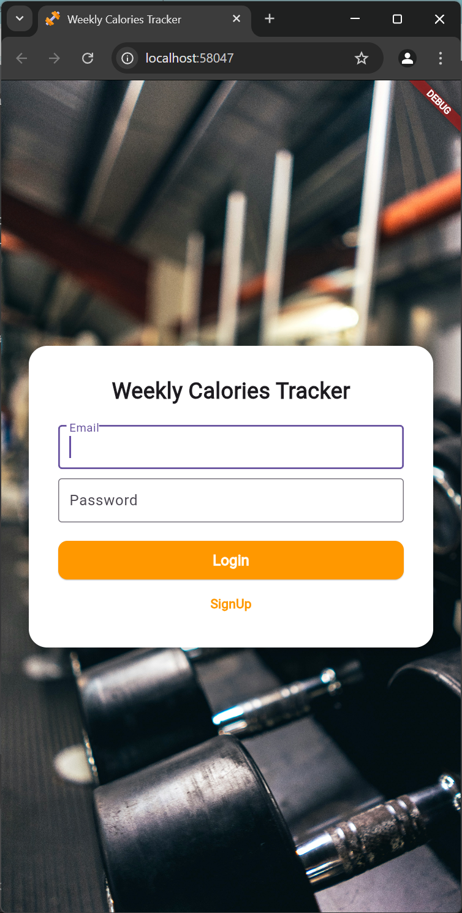
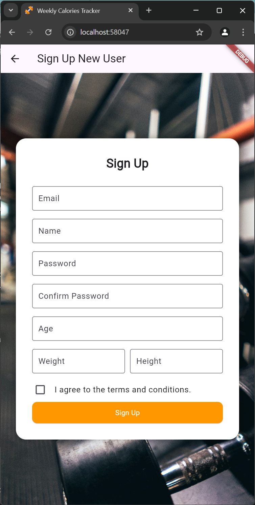
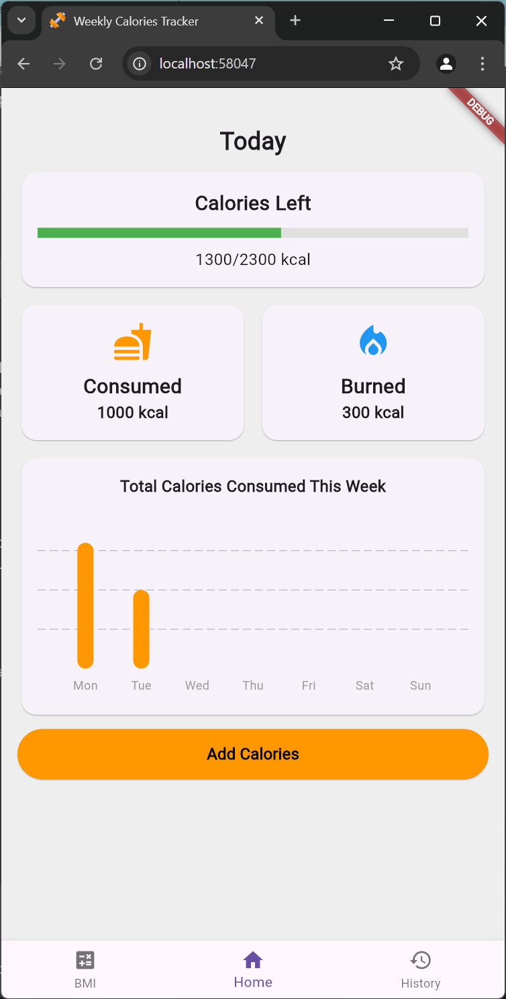
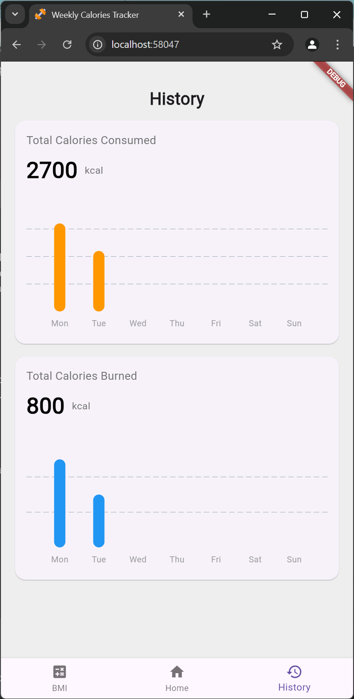
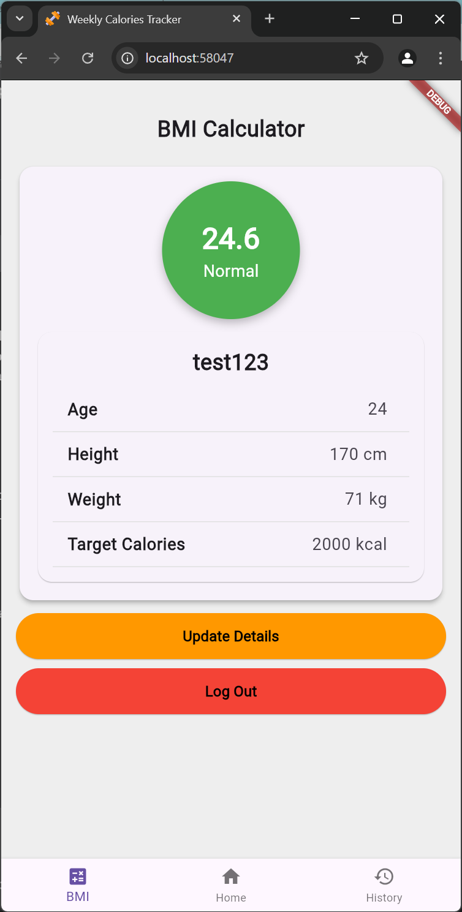

# Weekly Calories Tracker

A Flutter-based web application to track your weekly calorie intake and expenditure. Built with Firebase for authentication and data storage, this app helps you monitor your daily calories consumed and burned, visualize weekly trends, and reset data each week for a fresh start.

## Features
- **User Authentication**: Secure login/signup with Firebase Authentication.
- **Daily Tracking**: Add calories consumed and burned for each day.
- **Weekly Overview**: Visualize your calorie data with charts for the current week.
- **Automatic Reset**: Clears previous week's data every Monday to keep tracking fresh.
- **Responsive Design**: Works seamlessly on web browsers.

## Screenshots
  
  
  
  
